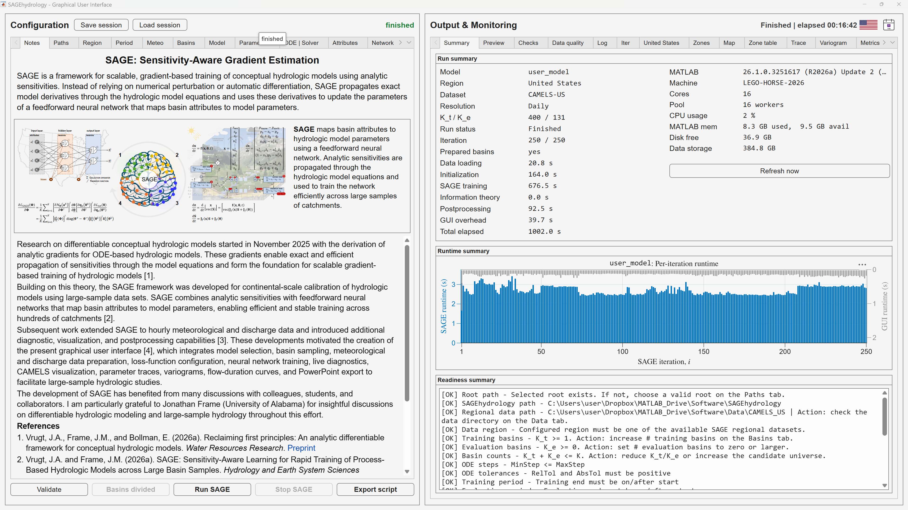
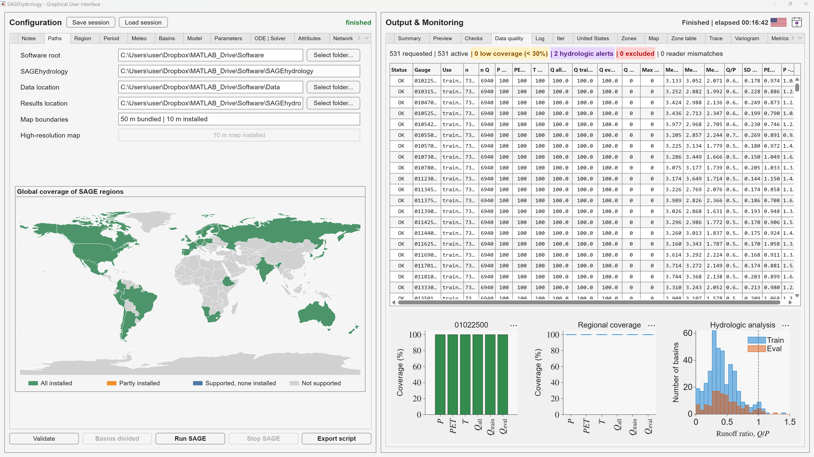
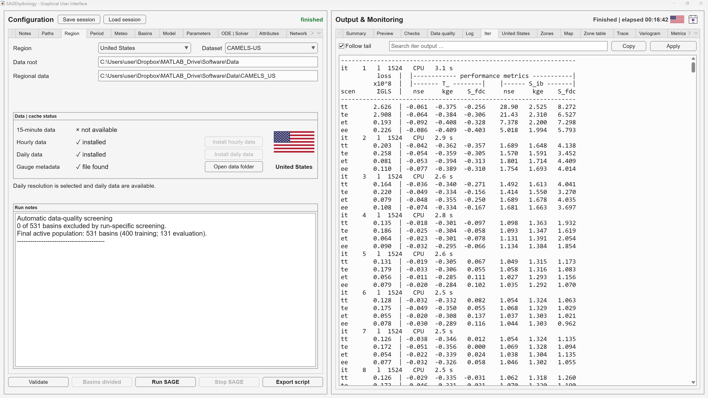
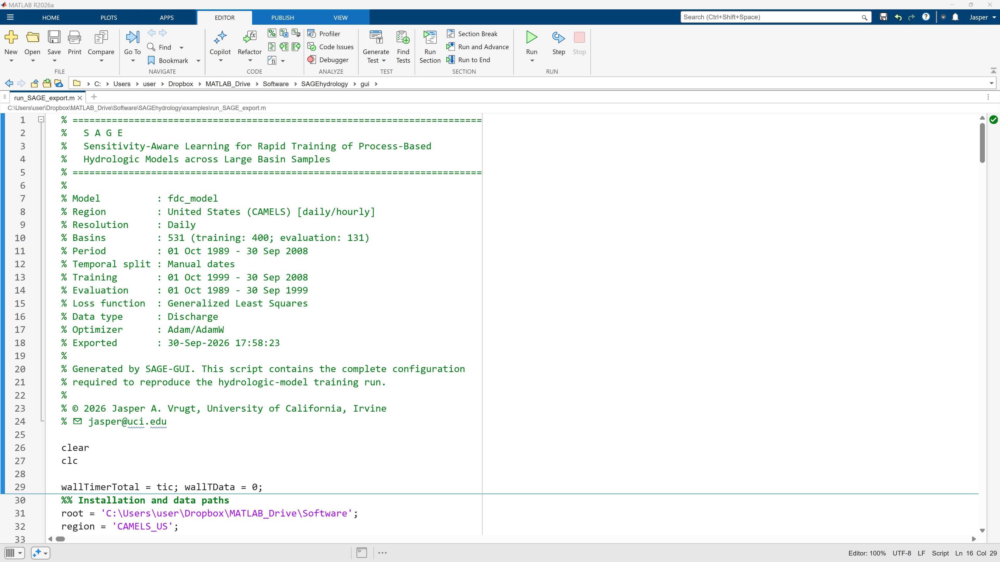

# SAGEhydrology

Sensitivity-Aware Gradient Estimation (SAGE) is a framework for scalable,
attribute-conditioned training of conceptual hydrologic models using analytic
forward sensitivities.

<p align="center">
  <a href="docs/images/sage-notes-run-summary.png"></a><br>
  <em>Figure 1. SAGE Notes workspace and summary of a completed hydrologic-model training run.</em>
</p>

This repository contains the public computational source for SAGEhydrology.
The graphical user interface is distributed as a compiled application through
the [GitHub Releases](https://github.com/jaspervrugt/SAGEhydrology/releases)
page; its source code is not part of this repository.

The SAGE GUI can automatically download, extract, organize, and register the
supported regional hydrologic and meteorological datasets. Users therefore do
not need to locate and arrange these data files manually for the standard
regional workflows.

<p align="center">
  <a href="docs/images/sage-data-quality-regional-coverage.png"></a><br>
  <em>Figure 2. Regional data-quality screening, training/evaluation counts, and hydroclimatic coverage.</em>
</p>

## Repository contents

```text
docs/                    Documentation graphics and model schematics
examples/demo_SAGE.mlx   Illustrated SAGE Live Script
flags/                   Regional flag assets
maps/                    Map assets and Natural Earth metadata
models/                  Hydrologic models and analytic sensitivity kernels
regions/                 Regional configuration and basin inventories
results/                 Empty destination for generated run results
src/                     Main SAGE training and postprocessing routines
utils/                   Shared readers, metrics, plotting, and utilities
```

Hydrologic and meteorological datasets, run results, caches, and GUI source
files are intentionally excluded.

## Installation

### Compiled graphical application

Download the appropriate installer from GitHub Releases. Windows builds use
MATLAB Runtime R2026a, which the installer can obtain from MathWorks. macOS
builds are published separately because standalone applications and MEX files
are platform-specific.

After installation, select a supported region and temporal resolution in the
GUI. SAGE identifies missing data and offers the corresponding download and
installation controls. The GUI downloads the source archives, extracts them,
applies the directory and naming conventions expected by SAGE, and prepares
the data for basin selection and quality screening. Manual data installation
remains available for users who already maintain local dataset copies.

<p align="center">
  <a href="docs/images/sage-data-installation-basin-map.png"></a><br>
  <em>Figure 3. Left: Region tab for selecting the United States and the CAMELS-US, CAMELS-H-US, or MACH-US dataset, with controls for installing the available data; CAMELS-US supports daily and hourly resolution, and Run Notes report the outcome of data-quality screening. Right: live training progress showing the loss function, median NSE, KGE, and S<sub>fdc</sub>, and integrated basin scores as functions of SAGE iteration.</em>
</p>

### MATLAB source

1. Clone or download this repository.
2. Use the GUI's automatic data installation, or place existing regional
   datasets manually in the layout selected by SAGE.
3. Open `examples/demo_SAGE.mlx`, select the SAGE root directory, and review
   the configuration before running it.
4. Compile platform-specific MEX kernels when required by the selected model
   and execution backend.

Pressing **Export script** in the SAGE GUI creates `run_SAGE_export.m`, a
stand-alone MATLAB script containing the complete validated configuration of
the current GUI experiment. Users can run this script directly in MATLAB as
an alternative to starting the run from the graphical interface. The GUI
provides live monitoring and interactive result tabs; the exported script
runs the same computational workflow from source and gives immediate access
to its MATLAB workspace variables, source functions, plotting routines, and
postprocessing tools. This makes it straightforward to inspect intermediate
results, customize analyses and figures, or reproduce and extend a run
programmatically.

<p align="center">
  <a href="docs/images/sage-matlab-export-script.png"></a><br>
  <em>Figure 4. MATLAB script exported by SAGE with the validated configuration required for reproducible source-based execution.</em>
</p>

The software does not bundle or redistribute CAMELS and other regional
datasets inside the source repository or application installer. Instead, the
GUI automates retrieval from the supported original data sources. Dataset use
remains subject to each provider's availability, citation requirements, and
license.

## Citation

Please cite the relevant SAGE publications listed in `CITATION.cff`. Additional
paper-specific citation information is included in the Live Script.

## Licensing

The computational source in this repository is licensed under the BSD
3-Clause License; see `LICENSE`.

Compiled SAGE GUI applications are separately licensed and are not covered by
the repository's BSD license. MATLAB Runtime and third-party datasets/assets
remain subject to their respective licenses.

## Contact

Jasper A. Vrugt  
University of California, Irvine  
jasper@uci.edu
